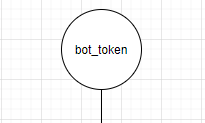
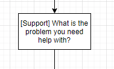
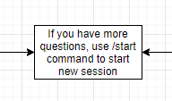
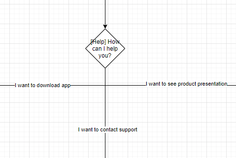
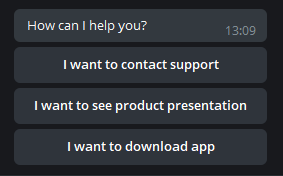
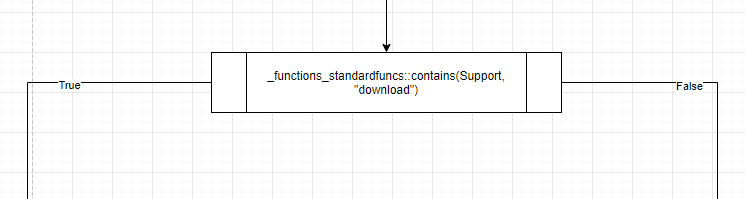
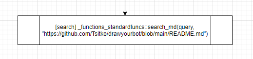
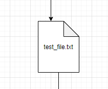

# README   

contacts: denis.tsitko@gmail.com

[support bot](https://t.me/drawyourbot_support_bot)  

[project blog](https://denis-tsitko.medium.com/)


Contents:  

- [Draw your bot](#draw-your-bot)  
    - [Install requirements](#install-requirements)
    - [Registering a telegram bot](#registering-a-telegram-bot)
    - [Draw bot](#drawing-a-bot)
        - [Start point](#start-point)
        - [Message block](#message-block)
        - [Single choice block](#single-choice-block)
        - [Functions block](#functions-block)
        - [File block](#file-block)
    - [Generating bot code](#generating-bot-code)  
    - [Use cases (quick start)](#use-cases)
- [Custom classes](#custom-classes)
    - [Arrow](#arrow)
    - [Start](#start)
    - [File](#file)
    - [Message](#message)
    - [SingleChoice](#singlechoice)
    - [FunctionsBlock](#functionsblock)
    - [BotStructure](#botstructure)
    - [BotCode](#botcode)
- [Standard functions](#standard-functions)
    - [contains](#contains)
    - [save_answers](#save_answers)
    - [search_md](#search_md)
- [Examples](#examples)
- [New features](#new-features)
- [Upcoming features](#upcoming-features)

# Draw your bot
Draw your bot is an open sourced project made to let people construct chat bots without coding or with minimal coding.
You can just draw your chat bot logic in draw.io (http://diagrams.net/) and generate its code.  
This project will be most useful for those who need to make simple support or survey bot.  
It could also save some time for those who are building really complex bots. In that cases generated bot can be
just a start point.

## Install requirements
First you need to install requirements from requirements.txt.  
The requirements are:
- python-telegram-bot library
- beautifulsoup4 library
- requests library

To install the requirements just use the following command:  
```
python -m pip install -r requirements.txt --user
```
## Registering a telegram bot
Now you need to register your bot in telegram and get its token. You can register your bot using /newbot command in
[botfather](https://t.me/botfather) telegram bot.  
[Here are the instructions](https://core.telegram.org/bots#6-botfather)

## Drawing a bot
As you registered your bot and got its token, you need to draw your bot logic in [draw.io](https://draw.io/).  
### Start point
Your bot should have exactly one start point. That is a circle or ellipse with your bot token as label:  
  
Your start point should have exactly one arrow.
### Message block
There are two types of messages: with name (that message will wait for users answer and you will be able to use that 
answer in your [functions blocks](#functions-block) and without name (that is just a text message which bot will print out).
Both are drawing as rectangle and should not have more when one outgoing arrow. Name of the message should be in
 square brackets at the beginning of blocks label.
You can use users answers in your message blocks. To use the answer, you need to add \_\_block name\_\_ into your 
message block (the example is an echo_bot in examples folder).  
Message with name example:  
  

Message without name example:  
  
### Single choice block
For single choice block you should use rhombus. It should always have name and each outgoing line should have label
which will be options in your bot.  
On your draw it will looks like that:  
  
  
And in your bot like that:  
    
### Functions block
You can use functions in your bot. There are some useful functions in standardfuncs.py and you can make your own file
with functions. You can use functions with a name or without (if you want functions return in your messages, 
you should give the name to your function).  
To give the name to your functions block you need to write that name in square brackets in the beginning of your 
function block.
All functions should have exactly two outcomes: True and False or exactly one unlabeled outcome 
(only for functions with names).  
You can use answers to your named message blocks and single choice blocks by providing blocks name to functions and
you can use all answers by providing *answers* keyword to your functions. And you can also use any other hardcoded 
parameters (for strings you should use quotes).  
Function should start with \_functions\_ keyword and contain the name of python file with your functions (without 
extension) and function name with its parameters.  
Example: \_functions\_fileWithFunctions::function(argument1, argument2, "string1", "string2")  
In your draw functions block without a name will look like that:  
    
The functions block with a name will look like that:  
  
## File block
You can send files to the user in your bot. To send a file, you need to use file block and provide a path to the file 
as a label to that block.  
In your bot structure it should look like that:  
  
You can use an outcome of your function block as a path to the file. For example if you have function block named 
'File name' which returns a path to the file, you should use its name in your file block like this:  
\_\_File name\_\_
## Generating bot code
To generate your bot code use the following command:  
```
python drawyourbot.py path_to_your_drawio_file
```
Your bot will be saved to **bots** path. To run it use the following command:  
```
python path_to_your_bot_file
```
## Use cases (quick start)
[Support bot based on your github readme.md](https://denis-tsitko.medium.com/support-telegram-bot-for-github-project-bb1a70a21628)  
[Library bot which will send random book of given genre to user](https://denis-tsitko.medium.com/library-telegram-bot-f7d2165ed5e3)  

# Custom classes
## Arrow
Arrow is a class for arrows.  
It has the following attributes:  
- id: string (arrow id)
- source: string (source element id)
- target: string (target element id)
- label: string (arrow label)
- target_element: Message, SingleChoice or FunctionsBlock (the target element for the arrow)
## Start
Start is a class for start point.  
It has the following attributes:
- id: string (start element id)
- label: string (start element label, which should be your telegram bot token)
- arrow: Arrow (start points outgoing arrow)
## File
File is a class for file blocks.
It has the following attributes:
- id: string (file block id)
- label: string (path to file)
- arrow: Arrow (outgoing arrow arrow)
- fname: String (file name)
## Message
Message is a class for message blocks.  
It has the following attributes:
- id: string (message block id)
- label: string (message text)
- name: string (message block name)
- arrow: Arrow (message block outgoing arrow)
- type: string (always "message")
## SingleChoice
SingleChoice is a class for single choice blocks.  
It has the following attributes:
- id: string (single choice block id)
- label: string (single choice text)
- name: string (single choice block name)
- arrows: list of Arrow (single choice block outgoing arrows)
- type: string (always "single choice")
## FunctionsBlock
FunctionsBlock is a class for functions blocks.  
It has the following attributes:
- id: string (functions block id)
- library: string (file with function)
- function: string (function with arguments)
- name: string (function name)
- function_args: string (function arguments in one string)
- arrows: list of arrow (functions block outgoing arrows)
- type: string (always "functions block")
## BotStructure
BotStructure class is initializing with the path to drawio file and loads its structure.  
It has the following attributes:
- root: xml.etree.ElementTree (xml with bot structure)
- errors: string (errors in bot structure drawio)
- arrows: list of Arrow (arrows from drawio)
- start: Start (start point)
- files: list of File (block to send a file to user)  
- messages: list of Message (message blocks)
- functions_blocks: list of FunctionsBlock (function blocks)
- single_choice_blocks: list of SingleChoice (single choice blocks)
## BotCode 
BotCode class initializing with BotStructure object. It generates bot code (*make_bot()* function) and writes that code
into file (*write_code()* function).
# Standard functions
## contains
Checks if first argument contains all of other arguments.  
All arguments should be strings (it could be the names of message and single choice blocks - in that case function will
check users answers to those blocks).
## save_answers
Saves all users answers into file.  
Takes *answers* keyword and the name of the file where it should save answers. 
## search_md
Searches for given as a first argument string in given as a second argument md file (needs a link to md in github) and 
returns a link to the most suitable section of that md.  
The example is support_md.drawio in examples folder.
# Examples
To generate a bot from drawio file in **examples** folder you need to open it in draw.io and change "bot_token" on 
start point to your [bots token](#registering-a-telegram-bot).  
After that just use the following command:  
```
python drawyourbot.py examples/drawio_file_name.drawio
```
Your bot will be saved into **bots**. You can run it with the following command:  
```
python bots/drawio_file_name.py
```
# New features
- Now you can send files to users (example of the bot to send a file: [simple_file.drawio](examples/simple_file.drawio)
   in examples folder). 
And you also can use custom functions to provide a file to send.
# Upcoming features
- An example of using database queries in functions
- An example of how to save user answers to database
